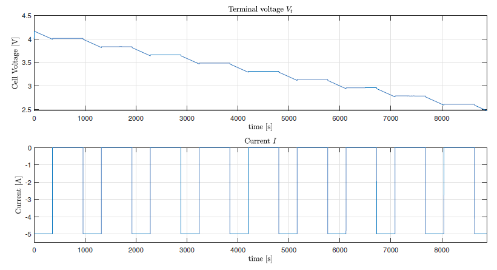
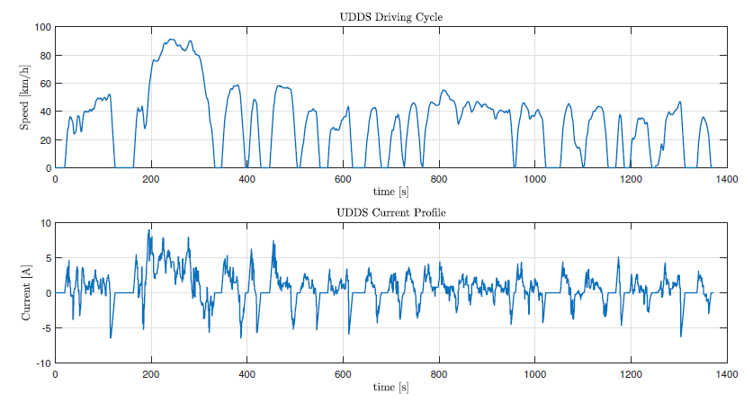
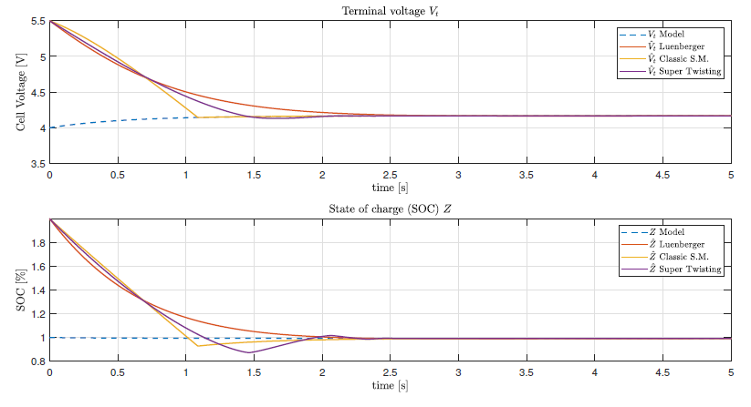

# State of Charge (SOC) Estimation for Li-Pb Batteries

This repository contains the implementation and simulation of three observers—Luenberger, Sliding Mode (SMO), and Super Twisting Observer (STO)—for estimating the State of Charge (SOC) of Lithium-ion batteries. The project compares their performance under constant current and Urban Dynamometer Driving Schedule (UDDS) discharge profiles.

## Description
Accurate SOC estimation is critical for Battery Management Systems (BMS) in electric vehicles. This work evaluates three model-based observers using an RC equivalent circuit battery model. Key contributions include:
- Implementation of Luenberger, SMO, and STO observers.
- Performance analysis using Integral Squared Error (ISE) and Integral Absolute Error (IAE).
- Simulations under constant current and dynamic UDDS profiles to assess convergence speed and robustness.
  
## Key Features
- **Battery Modeling**: Resistor-Capacitor (RC) equivalent circuit with parameter extraction.
- **Observers**:
  - **Luenberger Observer**: Linear state estimation with feedback correction.
  - **Sliding Mode Observer (SMO)**: Robust against modeling uncertainties with finite-time convergence.
  - **Super Twisting Observer (STO)**: Reduces chattering effects inherent in SMO.
- **Test Profiles**:
  - Constant current discharge.
  - Realistic UDDS cycle for dynamic current input.
- **Performance Metrics**: ISE and IAE for terminal voltage, SOC, and polarization voltage.

## Steps to run the Simulink file "soc_estimation.slx":
 - Run the model parameters file "model_parameters.m"
 - Install the driving cycle application by running the file ./drivecycle_/install.m
 - Open the Simulink file "soc_estimation.slx" to run the simulation
 - Use the MATLAB files "driving_cycle_smo_plots.m" and "plots_battery_modeling.m" to plot the results depending on the current profile
 
Results for the Li-ion battery modeling for a pulsed discharging profile. 

Current requested by the car using the UDDS driving cycle. 

State of charge (SOC) estimation by the three studied obrservers.

